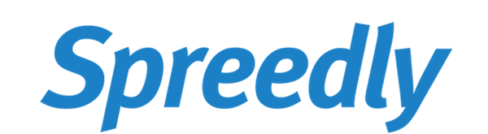

title: Preparing Your First Conference Talk
author:
  name: Ashley Hunsberger, DeeDee Lavinder, Emily Stamey
  twitter: WWCodeRaleigh
  url: https://www.womenwhocode.com/raleigh-durham
theme: select/cleaver-select-theme
style: basic_style.css
output: speaker_workshop.html
controls: true

--

# Preparing Your First Conference Talk!

  - Ashley Hunsberger @aahunsberger
  - DeeDee Lavinder
  - Emily Stamey @elstamey
    @WWCodeRaleigh

--

--
# Mixer ideas

- What kind of shoes are you wearing?
- What is your favorite color?
- Where did you live when you took your first tech job?
- What is your favorite conference?
- What is your favorite language or technology?

--

# Let's sit down and get started

--

# Resources for today

[http://github.com/elstamey/wwcrdu-presentations](http://github.com/elstamey/wwcrdu-presentations)

[Join us on Slack](https://docs.google.com/forms/d/e/1FAIpQLSctj9HJr-5yadDbKYygBYBfNUWmjgODlkp8lgLou26AedIkuQ/viewform)

--

# Writing Your Bio

--

# Bio Prompts

- Clear your mind
- We are going to give you prompts
- Fill them in as best as you can
- You can come back to these later to write your bio

--

# List 10 Accomplishments

--

# Write 5 things you can teach

--

# You are Crafting Your Credibility!

--

# Results You've Created

--

# Awards / Honors

--

# Mainstream Press

- Are you mentioned in a press release/news?
- What is newsworthy about you?

--

# Affiliations & Relationships

- Impressive institution you've been associated with
- Formal education or training
- Company you've worked for

--

# What Are Key/Unique Parts of Your Story?

--

# What are Your Skills?

- languages
- tools
- ...

--

# What Are Your Strengths?

--

# What Roles Have You Worked?

--

# Key Experiences

- Jobs, Internships, Apprenticeships
- Organizations you're affiliated with
- Schools/education/certificates
- Projects you've worked on

--

## What’s Your Unique VALUE PROPOSITION?

-fragment Whoever is consuming what you’re giving needs to know what they will get from you?
- What can you uniquely give to the world based on what you’ve done?
- What is the lens through which your content is filtered?

--

## What are Challenges You Have Faced/Overcome?

- What did you learn?
- What strengthened and reinforced your roots?

--
# Branding Yourself

[Branding is More Than Self Promotion - Neha Batra](https://www.safaribooksonline.com/library/view/oscon-2017-/9781491976227/video309578.html)

--

# What 3 words do you want people to use to describe you?

--

# Write to 3 people you work with

- Ask them to use 3 words to describe you

`I'm in the middle of a talk, and I need you to tell me this. What are my top three qualities?`

--

# Compare Their 3 Words With Yours

- What could you do more of to represent a word they didn't use to describe you?

--

# Crafting your Bio

--

## Review Your List of Lists

- Use a highlighter
- What makes you excited?
- What makes you proud?
- What do you want to use in the future?
- Are there any recurring themes/threads?

--

# Write Your Bio

- Write a short blurb (speaker bio, articles, etc)
- Write a longer bio (website, blog, etc)
- Use descriptive language
- Use action verbs
- Sound Excited!

--

# Final edits:

- Use the tools you have
- Quantify with data
- Invert the negatives
- Give credit to personal experience

--

# Phrasing

- I work at/do
- In my spare time, I
- I’m obsessed with/have passion for
- I work with people who

--

# Be Actionable

- I build / I’ve built
- I lead / I’ve lead

--

# Be Specific

- I’ve been a ____ for x years
- I organize
- Recently I’ve been

--

# Be Kind

--

--

# Topics and ideas for talks

- Things you can teach
- Things you want to learn`
- A story about something you or your team did
- Something you've accomplished

--

# Lunch

--

# Call for Papers.  What does that mean?

--

# Call For Papers

- Have a deadline for submissions (time zones are important)
- Some conferences accept talks while the CFP is open
- Submissions are reviewed by a committee, sometimes blindly
- Keynotes are often decided outside of CFP

--

# Speaker Package

** Read it carefully **
- May provide hotel and airfare
- May offer reimbursement up to an amount
  - Pay attention to how they will reimburse

--

# You submit an abstract

- Provide a description of your talk
  - if accepted, this is put on the conference website

--

# Other info

- Often a notes section
  - past or upcoming speaker experience
  - additional description of your talk
  - Learning Objectives (attendees will learn...)
- Do you need travel assistance?  **YES!**
- Give airport code

--

# The abstract

--

# Tips for a good Abstract

- Relevance
- Takeaways
- The title is important
- Readability
- Timeframe
- Proofread
- https://twitter.com/friendlytester/status/962782536089956352 

--

# Relevance

- Is it targeted to the conference and the audience?
- Is it unique? Why is your talk better than the other 40 submissions on this topic?
- Is the topic current?

--

# Takeaways

- What will I learn?
- What can attendees take back to work?

--

# The Title

- The first thing reviewers see
- Sets the scene for the rest of the abstract
- Positivity! 

--

# Readability

- Does it flow? Do you jump around too much? 
- Does it have a beginning, middle and end?
- Keep it concise. Make your words count.
  - Use action verbs

--

# Timeframe

- How long is your talk?
- Will it fit in a 30 minute slot?

--

# Proofread!

- Have you read your abstract?
- Read it again. Now do it one more time!

--
# Write a talk proposal!

- 3 minutes to brainstorom a proposal for a 30-minute presentation
- Start writing proposal, following worksheet
- 5 minutes

--

# Give/Get Feedback

- Actionable, Specific, and Kind
- Can you identify what the talk is about?
- Can you identify the takeaways?
- Does it have enough relevance to the attendees?
- Will this talk fit in the allotted timeframe?
- RESOURCE: Paper. 

--

# Pitch Your Abstract

  Write a lightning talk to pitch the idea of your talk.  Why is it important?

2-3pm

--

# Pitch your idea

3-4 presenting and feedback

--

# Resources

- [HelpMeAbstract.com](HelpMeAbstract.com)
- [SpeakingEasy](http://speaking-easy.com/)
- Rubric for Abstract (to get from AshleyH or AshleyPQP)
